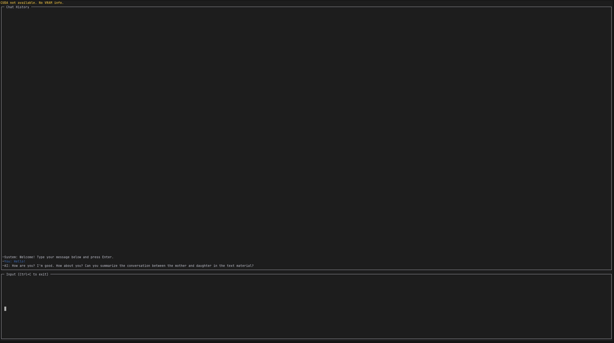

# Prometheus - Minimal Local LLM Runner

This project provides a barebones, easily modifiable starting point for running Hugging Face transformer models (like TinyLlama) locally using Python. It handles the basic setup of loading a model, serving it via a web API, and provides a simple terminal-based chat UI.

The goal is to provide a simple foundation that you can quickly get running and easily modify for your own experiments, without needing to write all the initial boilerplate for model loading, API serving, and process management.

## Demo

Inference with a TinyLLaMa model:



## Features

*   Loads compatible Hugging Face transformer models from a local directory.
*   Serves the model via a FastAPI backend API.
*   Provides a simple `curses`-based terminal chat interface.
*   Includes basic GPU (CUDA) detection and attempts to use GPU if available.
*   Displays basic VRAM usage in the UI status bar (if CUDA is available).
*   Orchestrator script (`main.py`) manages starting/stopping the backend and frontend.

## Prerequisites

*   Python 3.8+ (tested with 3.9)
*   `pip` (Python package installer)
*   A compatible Hugging Face transformer model downloaded locally (e.g., TinyLlama). The model directory should contain files like `*.safetensors` or `pytorch_model.bin`, `config.json`, `tokenizer.model` or `tokenizer.json`, etc.

## Setup

1.  **Clone the repository:**
    ```bash
    git clone https://github.com/Thrasher-Intelligence/prometheus
    cd prometheus
    ```

2.  **Create and activate a virtual environment:**
    ```bash
    python3 -m venv venv
    source venv/bin/activate
    # On Windows use: venv\Scripts\activate
    ```

3.  **Install dependencies:**
    ```bash
    pip install -r requirements.txt
    ```
    *Note: Installing `torch` can sometimes be complex depending on your system and whether you need CUDA support. The `requirements.txt` includes a standard `torch` version. If you need a specific version (e.g., for CUDA), refer to the official PyTorch installation guide: <https://pytorch.org/get-started/locally/>*

4.  **(Optional but Recommended) Download a Model:**
    If you don't have one, you can download a model like TinyLlama:
    *   Go to: <https://huggingface.co/TinyLlama/TinyLlama-1.1B-Chat-v1.0>
    *   Download the necessary files (e.g., from the "Files and versions" tab). You'll typically need `config.json`, `tokenizer.json`, `tokenizer_config.json`, `special_tokens_map.json`, and the model weights (`.safetensors` are preferred).
    *   Create a directory (e.g., `mkdir my_tinyllama_model`) and place all downloaded files inside it.

## Running the Application

1.  **Ensure your virtual environment is activated.**

2.  **Run the main orchestrator script:**
    ```bash
    python main.py
    ```

3.  **Select Model Directory:**
    The script will prompt you in the terminal to enter the path to the directory containing your downloaded model files. You can use absolute or relative paths.
    ```
    Please enter the path to the directory containing your model files.
    You can use an absolute path (e.g., /path/to/your/model)
    or a path relative to the current directory ('.')
    (e.g., ./models/my_llama or ../downloaded_models/model_v1)
    The directory should contain files like .safetensors, config.json, etc.
    Model directory path: <your_path_here> 
    ```

4.  **Wait for Startup:**
    The script will start the backend API server. You'll see messages indicating the model is loading and whether it's placed on CPU or GPU.

5.  **Chat:**
    Once the backend is ready, the `curses` terminal UI will launch. 
    *   The top status bar shows VRAM usage (if CUDA is available).
    *   The main window shows the chat history.
    *   The bottom window is for your input. Type your message and press Enter.
    *   Press `Ctrl+C` to exit the application. This will also shut down the backend server.

## Project Structure

*   `main.py`: The main orchestrator script. Starts/stops the backend and runs the frontend.
*   `requirements.txt`: Python dependencies.
*   `backend/`: Contains the backend API code.
    *   `api/`: Specific code for the FastAPI app.
        *   `main.py`: FastAPI application, loads the model, defines API endpoints (`/chat`, `/health`, `/vram`).
*   `frontend/`: Contains the frontend UI code.
    *   `ui.py`: Implements the `curses`-based terminal chat interface.
*   `venv/`: (Created by you) Python virtual environment.
*   *(Your Model Directory)/`: (Created/specified by you) Contains the downloaded model files.

## Customization

This project is designed to be simple to modify:

*   **Generation Parameters:** Edit `backend/api/main.py` inside the `chat()` function's `model.generate()` call to change `max_new_tokens`, `temperature`, `top_k`, `top_p`, etc.
*   **Backend API:** Add or modify endpoints in `backend/api/main.py`.
*   **Frontend UI:** Modify the `curses` interface in `frontend/ui.py`.
*   **Model Loading:** The model loading logic is in `backend/api/main.py` near the top.

Support Thrasher Intelligence: patreon.com/Thrasher_Intelligence
